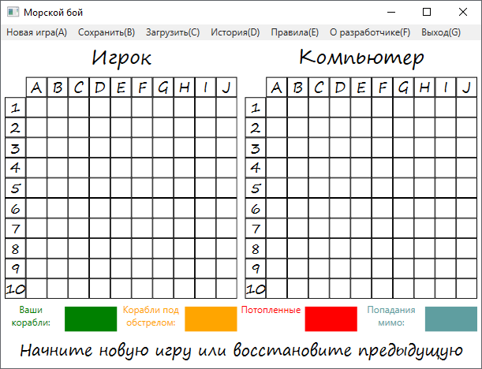
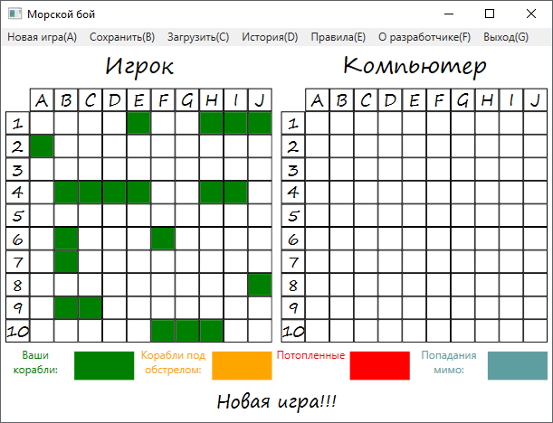
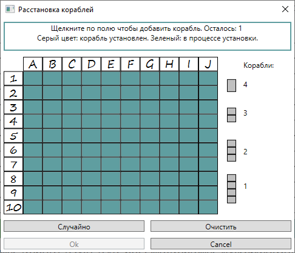
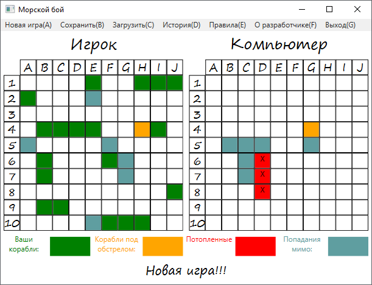

# BattleShip
Implementation of a well-known board game in the ```C#``` programming language using Microsoft's ```WPF``` technology.
The application has the ability
- ships arrangement or autoarrangement
- playing against a computer
- saving and loading game process
- display moves history
- hotkeys

## App starting view



## Code description
In project used the following technologies:
- .NET Framework 4.7.2
- WPF Framework (without MVVM)

## App examples

### Game beginning
Player's field located on the left side. Panel with colors on bottom got description for each color on the game field.
Text at the bottom panel displays game status.



### Arrangement
Player can set each ship on the fieldbut also ships could be set randomly. 



### Game example


